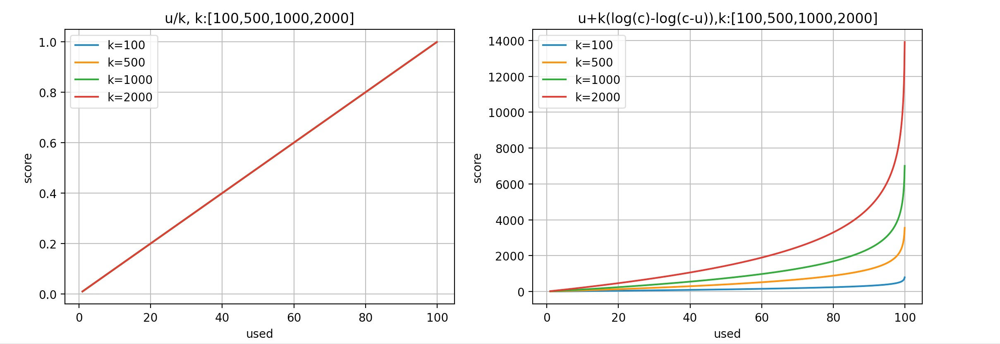

# PD Score simulator
## use 
### file desc
Iscore.py: the interface file(abstract class ), score method should imple 
score.py: the implement class 
score_plot: the program  entry(main_file)
score_3D:  not implement 

### prepare
1. install python3
1. intstall 
1. install matplotlib

## run
python3 ./score_plot.py 
## custom function to calculate score
1. create new python file 
2. to implement score interface
```golang

import numpy as np
from Iscore import IScore
class Score(IScore):
    # k: control variable
    # x: used ratio 
    def score(self,k,x:np.ndarray):
        u=x/100*self.capacity
        return  u/self.capacity
```
3. modify score_plot.py 
4. run 
## result
